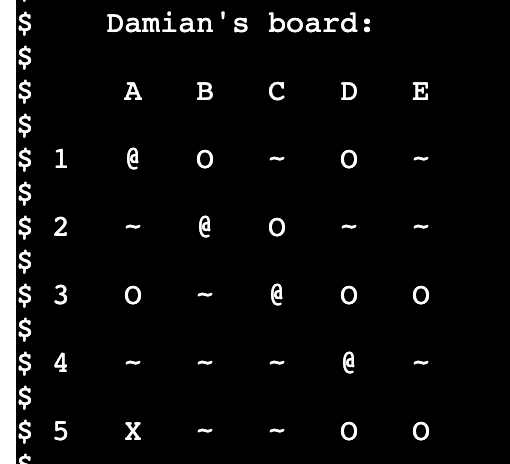
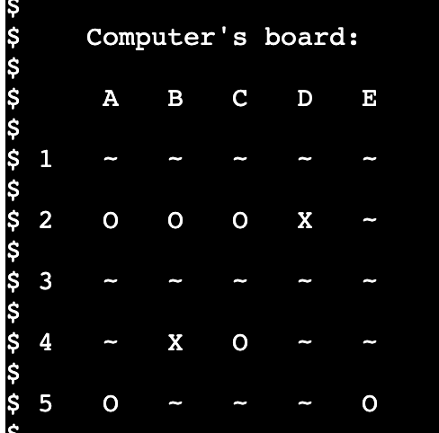
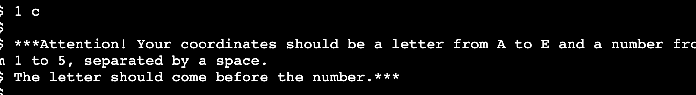
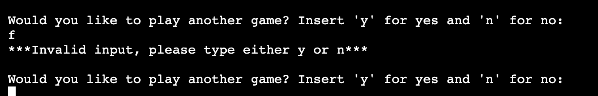
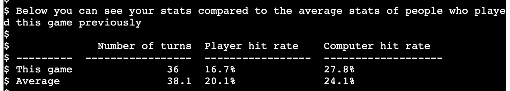
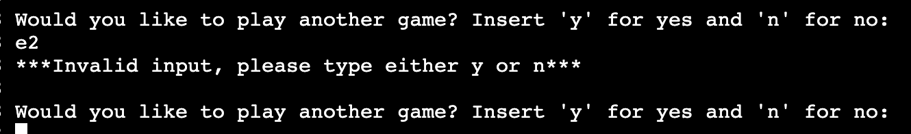
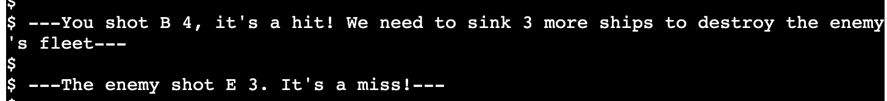
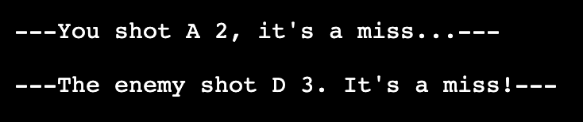
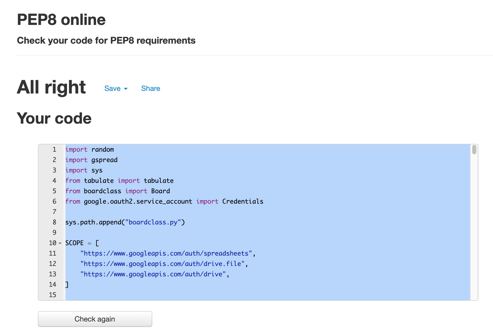
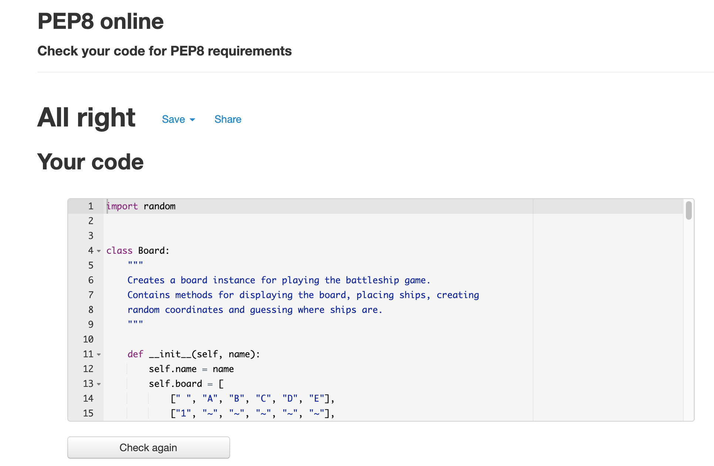

- [CI-MS3-battleship](#ci-ms3-battleship)
  * [How to play](#how-to-play)
  * [Technologies used](#technologies-used)
  * [Features](#features)
    + [Existing features](#existing-features)
  * [Testing](#testing)
    + [PEP8](#pep8)
    + [Fixed errors](#fixed-errors)
  * [Bugs](#bugs)
  * [Deployment](#deployment)
  * [Credit](#credit)
    + [Content](#content)
  * [Acknowledgements](#acknowledgements)

<small><i><a href='http://ecotrust-canada.github.io/markdown-toc/'>Table of contents generated with markdown-toc</a></i></small>

# CI-MS3-battleship

See live version of app: https://battleship-strategy.herokuapp.com/

The goal of this project is to create an interactive battleship game in a Python terminal that stores certain information about each game in a separate Google sheet.

## How to play

In this game you will have to fight against the computer in a classical battleship game. 
First of all, the game will ask you to insert your name. You can then choose whether you'd like to place your ships on the board of if you'd like them to be placed on the board randomly. The board consists of a 5x5 square, with coordinates for each field: a letter from A to E for columns and a number from 1 to 5 for rows.
In order to select a coordinate, the correct format is letter space number (A 1). If this format is not followed, an error message will be thrown.
Once you have placed your ships, the game starts: Either you or the computer start and you have to try to guess the positions of your ships by entering the coordinates. Whoever destroys the fleet of their enemy first, wins!
At the end you will be able to see some stats about the game and how you did compared to the average of all the games that have been played before.

## Technologies used

I used python to create the code of the game. I imported some libraries: random for the creation of random numbers, gspread so that I could access my Google Sheet file, sys so that I could append the file path to my second python module, where I stored the class definition. I used VSCode and deployed the game on Heroku.

## Features
### Existing features
Player board:

Screenshot of Player board

Computer board:

Screenshot of Computer board

Error messages:

Format error message

Invalid input error message

Same coordinate error message

Game stats table:

Screenshot of game stats

Screenshot replay question

Game messages: 

Game messages

Game messages

## Testing
I did multiple rounds of manual testing until there were no more errors or bugs. Most of the testing was done in VSCode terminal, and a few last rounds in the Heroku terminal.

### PEP8
No errors were returned when passing through the official PEP8 validator

Screenshot of PEP8 validator

Screenshot 2 of PEP8 validator

### Fixed errors
- I fixed the line lenghts, which was the most frequent error. After fixing that, i had to reformat some of the strings that are printed to the terminal.
- I deleted some whitespaces

## Bugs

There were many minor bugs during the creation of this project. The biggest one was the following:
The file would seemingly stop running in the middle of a game, without any error message. After adding some print statements, I discovered that the reason was in the guess_player_ships method: that method used to come up with a random coordinate and then run through a loop: if that coordinate had already been hit, the loop would re-run until a non-hit coordinate would appear. I didn't think this through because obviously with every turn the likelihood of finding a coordinate that had not been hit yet decreases, so that function entered an infinite loop.
I fixed the bug by simply creating a list with all the coordinates, pull a random coordinate, and then delete that coordinate from the list.

## Deployment
The app was deployed to Heroku. See the live link: https://battleship-strategy.herokuapp.com/

## Credit

### Content
   I often referred back to various lessons from Code Institute and to W3schools or MDN. Stackoverflow was a useful source of information, especially for resolving bugs.

## Acknowledgements
I would like to thank my co-students who took their time to answer my questions or doubts on Slack, my mentor Mo Shami who gave me precious advice and lent me his expertise and the tutors of Code Institute who have saved me when i was stuck, in particular John who helped me out with a last-minute problem with the deployment. Thank you!

